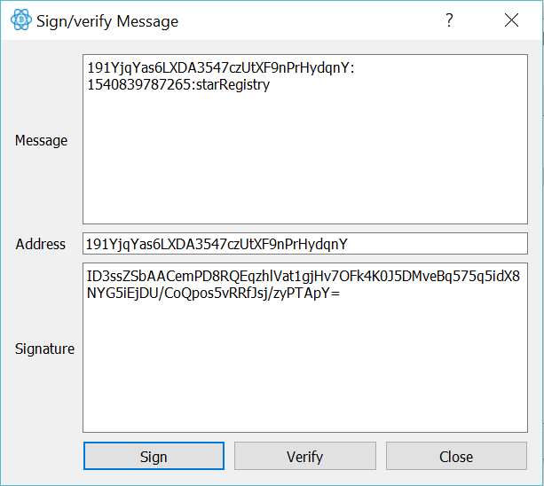

# Project 4 - BUILD A PRIVATE BLOCKCHAIN NOTARY SERVICE
In this project, we add some functionality to the WEB API of the Udacity BDND project 3: webservices, that provides a Star Registry service allowing users to claim ownership of their favorite star in the night sky.

The features required to build into the WEB API are:
* Notarize: Users will be able to notarize star ownership using their blockchain identity.
* Verify Wallet Address: Your application will provide a message to your user allowing them to verify their wallet address with a message signature.
* Register a Star: Once a user verifies their wallet address, they have the right to register the star.
* Share a Story: Once registered, each star has the ability to share a story.
* Star Lookup: Users will be able to look up their star by hash, block height, or wallet address.

## Star Coordinates
Understanding how a star is represented will impact how a the star details are stored and retrived in a private blockchain.

### Star Coordinate Example
Here is an example of how star coordinates are represented.

`RA 13h 03m 33.35sec, Dec -49° 31’ 38.1” Mag 4.83 Cen`

These coordinates are similar to latitude and longitude but instead relate to coordinates in the sky.

### Abbreviations
Within this data, you’ll notice a few abbreviations. Here is what each of these abbreviations stands for.

> RA = Right Ascension

> DEC = Declination

> CEN = Centaurus

> MAG = Magnitude

Note: Mag stands for magnitude, which is the brightness of the star.

### Interesting Star Fact
The limiting brightness of stars seen with the naked eye is about magnitude 6.5. With binoculars, you can see to magnitudes of about 10. Cen, in this case, stands for Centaurus, one of the 88 constellations that can be found in the sky. Knowing the constellation can help you locate a star more easily.

## Blockchain ID Validation Routine
### Requirement 1: Allow User Request
The Web API will allow users to submit their request using their wallet address.

* The web API will accept a Blockchain ID with a request for star registration.
* The user's Blockchain ID will be stored with a timestamp.
* This timestamp must be used to time wall the user request for star registration.
* In the event the time expires, the address is removed from the validation routine forcing the user to restart the process.

Copy an address from your wallet using ELECTRUM.
`191YjqYas6LXDA3547czUtXF9nPrHydqnY`

### Requirement 2: Deliver User Response
After submitting a request, the user will receive a response in JSON format with a message to sign.

* Message details
* Request timestamp
* Time remaining for validation Window

With this response, a request will be made to the user to provide a signature using their wallet.

### Requirement 3: Validate User Request
This signature proves the users blockchain identity. Upon validation of this identity, the user should be granted access to register a single star.

#### URL
This functionality should be made available at the following URL.
> method: POST

> http://localhost:8000/requestValidation

```
curl -X "POST" "http://localhost:8000/requestValidation" \
     -H 'Content-Type: application/json; charset=utf-8' \
     -d $'{
     "address": "191YjqYas6LXDA3547czUtXF9nPrHydqnY"
    }'
```

output JSON Response:

```
{ 
  address: '191YjqYas6LXDA3547czUtXF9nPrHydqnY',
  message: '191YjqYas6LXDA3547czUtXF9nPrHydqnY:1540839787265:starRegistry',  requestTimeStamp: 1540839787265,
  validationWindow: 300 
}
```

### Requirement 4: Allow User Message Signature
After receiving the response, users will prove their blockchain identity by signing a message with their wallet. Once they sign this message, the application will validate their request and grant access to register a star.

#### URL
This functionality should be provided at the following URL.

#### Payload
The payload delivered by the user requires the following fields.

* Wallet address
* Message signature

#### Message Configuration
Message for verification can be configured within the application logic from validation request.

* `[walletAddress]:[timeStamp]:starRegistry`



> Method: POST

> http://localhost:8000/message-signature/validate
```
curl -X "POST" "http://localhost:8000/message-signature/validate" \
     -H 'Content-Type: application/json; charset=utf-8' \
     -d $'{
  "address": "191YjqYas6LXDA3547czUtXF9nPrHydqnY",
  "signature": "ID3ssZSbAACemPD8RQEqzhlVat1gjHv7OFk4K0J5DMveBq575q5idX8NYG5iEjDU/CoQpos5vRRfJsj/zyPTApY="
}'
```

Output JSON Response:
```
{"registerStar":true,"status":{"address":"191YjqYas6LXDA3547czUtXF9nPrHydqnY","message":"191YjqYas6LXDA3547czUtXF9nPrHydqnY:1540839787265:starRegistry","requestTimeStamp":1540839787265,"validationWindow":300}}
```

## Step 2: Configure Star Registration Endpoint
After configuring the Blockchain validation routine, you’ll configure the star registration endpoint. This will allow your application to accept users requests. In this section, we'll provide resources on how to do this effectively.

### URL
This functionality should be provided at the following URL.

### Payload
Wallet address (blockchain identity), star object with the following properties.

* Requires address [Wallet address]
* Requires star object with properties
* right_ascension
* declination
* magnitude [optional]
* constellation [optional]
* star_story [Hex encoded Ascii string limited to 250 words/500 bytes]
* JSON Response
* block object

> Method: POST

> http://localhost:8000/block

```
curl -X "POST" "http://localhost:8000/block" \
     -H 'Content-Type: application/json; charset=utf-8' \
     -d $'{
  "address": "191YjqYas6LXDA3547czUtXF9nPrHydqnY",
  "star": {
    "dec": "-26° 29'\'' 24.9",
    "ra": "16h 29m 1.0s",
    "story": "Found star using https://www.google.com/sky/"
  }
}'
```
Output JSON Response
```
{"hash":"74b4f2ad649d4bfae87aa379b6bd8fe9bb416d5fcf78cc73acb871c5af566890","height":13,"body":{"address":"191YjqYas6LXDA3547czUtXF9nPrHydqnY","star":{"dec":"-26� 29' 24.9","ra":"16h 29m 1.0s","story":"Found star using https://www.google.com/sky/"}},"time":"1540839936","previousBlockHash":"fd2d13f8353a1900854e476c5c9daeacf8185201476caac0392c40618352fb4a"}
```

## Step 3: Configure Star Lookup
Now that you have configured the star registration endpoint, you’ll need to configure the star lookup.

This functionality will provide the option to search by blockchain wallet address, by star block hash, and by star block height. We’ve broken this down into 4 requirements and provide the details below to help get you started.

* Requirement 1: Search by Blockchain Wallet Address
* Requirement 2: Search by Star Block Hash
* Requirement 3: Search by Star Block Height

> Method GET

### GETBLOCK by ADDRESS
```
curl "http://localhost:8000/stars/address:191YjqYas6LXDA3547czUtXF9nPrHydqnY"
```

Output JSON RESPONSE
```
[{"hash":"a5e411ff559cf2db239cd529fdb67115d0c3e5884dce5b4200f40c3f54aa87c6","height":10,"body":{"address":"191YjqYas6LXDA3547czUtXF9nPrHydqnY","star":{"dec":"-26� 29' 24.9","ra":"16h 29m 1.0s","story":"Found star using https://www.google.com/sky/","storyDecoded":""}},"time":"1540762878","previousBlockHash":"2285af4c6a2ae7a9e177ed2e6621fb69d928dd1d39f0530c062f1ff65a8dbee9"},{"hash":"805010dabc7e1046ac9c967f6149b69f820ad522ee6497912aaf24c722cacf65","height":11,"body":{"address":"191YjqYas6LXDA3547czUtXF9nPrHydqnY","star":{"dec":"-26� 29' 24.9","ra":"16h 29m 1.0s","story":"Found star using https://www.google.com/sky/","storyDecoded":""}},"time":"1540763061","previousBlockHash":"a5e411ff559cf2db239cd529fdb67115d0c3e5884dce5b4200f40c3f54aa87c6"},{"hash":"fd2d13f8353a1900854e476c5c9daeacf8185201476caac0392c40618352fb4a","height":12,"body":{"address":"191YjqYas6LXDA3547czUtXF9nPrHydqnY","star":{"dec":"-26� 29' 24.9","ra":"16h 29m 1.0s","story":"Found star using https://www.google.com/sky/","storyDecoded":""}},"time":"1540768061","previousBlockHash":"805010dabc7e1046ac9c967f6149b69f820ad522ee6497912aaf24c722cacf65"},{"hash":"74b4f2ad649d4bfae87aa379b6bd8fe9bb416d5fcf78cc73acb871c5af566890","height":13,"body":{"address":"191YjqYas6LXDA3547czUtXF9nPrHydqnY","star":{"dec":"-26� 29' 24.9","ra":"16h 29m1.0s","story":"Found star using https://www.google.com/sky/","storyDecoded":""}},"time":"1540839936","previousBlockHash":"fd2d13f8353a1900854e476c5c9daeacf8185201476caac0392c40618352fb4a"},{"hash":"9dc8bee4dac6a8c4e1f473e80476391b2f54e2b49cb08de97d782142ef6ea4c0","height":8,"body":{"address":"191YjqYas6LXDA3547czUtXF9nPrHydqnY","star":{"dec":"-26� 29' 24.9","ra":"16h 29m 1.0s","story":"Found star using https://www.google.com/sky/","storyDecoded":""}},"time":"1540758169","previousBlockHash":"d8ae4bf352c6582eab06ea16c60cdd8d5054b8d7a93791442436d272f1792aa2"},{"hash":"2285af4c6a2ae7a9e177ed2e6621fb69d928dd1d39f0530c062f1ff65a8dbee9","height":9,"body":{"address":"191YjqYas6LXDA3547czUtXF9nPrHydqnY","star":{"dec":"-26� 29' 24.9","ra":"16h 29m 1.0s","story":"Found star using https://www.google.com/sky/","storyDecoded":""}},"time":"1540758179","previousBlockHash":"9dc8bee4dac6a8c4e1f473e80476391b2f54e2b49cb08de97d782142ef6ea4c0"}]
```


### MESSAGE - GETBLOCK by HASH
```
curl "http://localhost:8000/stars/hash:a5e411ff559cf2db239cd529fdb67115d0c3e5884dce5b4200f40c3f54aa87c6"
```

Output JSON Response
```
{"hash":"a5e411ff559cf2db239cd529fdb67115d0c3e5884dce5b4200f40c3f54aa87c6","height":10,"body":{"address":"191YjqYas6LXDA3547czUtXF9nPrHydqnY","star":{"dec":"-26� 29' 24.9","ra":"16h 29m 1.0s","story":"Found star using https://www.google.com/sky/","storyDecoded":""}},"time":"1540762878","previousBlockHash":"2285af4c6a2ae7a9e177ed2e6621fb69d928dd1d39f0530c062f1ff65a8dbee9"}
```

### MESSAGE - GETBLOCK by HEIGHT
```
curl "http://localhost:8000/block/8"
```

Output JSON Response
```
{"hash":"9dc8bee4dac6a8c4e1f473e80476391b2f54e2b49cb08de97d782142ef6ea4c0","height":8,"body":{"address":"191YjqYas6LXDA3547czUtXF9nPrHydqnY","star":{"dec":"-26� 29' 24.9","ra":"16h 29m 1.0s","story":"Found star using https://www.google.com/sky/"}},"time":"1540758169","previousBlockHash":"d8ae4bf352c6582eab06ea16c60cdd8d5054b8d7a93791442436d272f1792aa2"}
```

